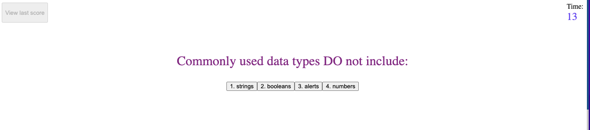

# Code-Quiz

## Description

This project was created to build a timed coding quiz with multiple-choice questions. 

This app runs in the browser, and features dynamically updated HTML and CSS powered by JavaScript.

If the user answers all the questions before the timer runs out, they will be able to start the initials and score until the next time the game is completed.

## Installation

N/A

## Usage

The URL to the page is 

Click on the "start" button to begin the game.

Answer the questions before the timer reaches 0. Each question answered incorrectly will result in a ten second penalty.

When all the questions have been answered, the user will be able to enter their initials.

The last score can be viewed and reset button clicked to restart the game.

## License

Please refer to the LICENSE in the repository.

